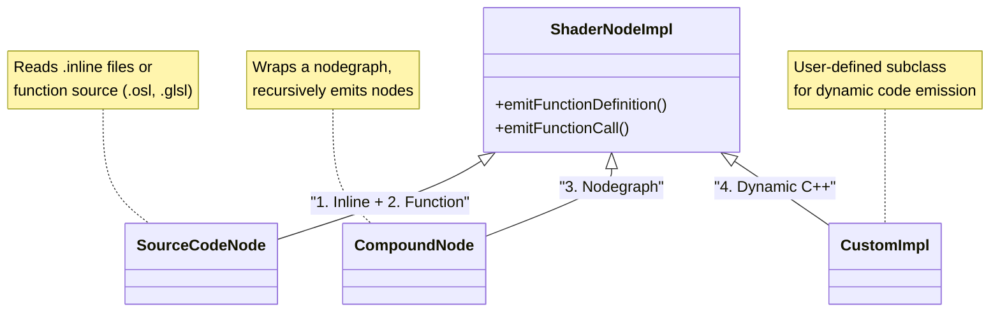

# metashade-mtlx

Prototyping integrations of [Metashade](https://github.com/metashade/metashade) into [MaterialX](https://github.com/AcademySoftwareFoundation/MaterialX)

## Per-node MaterialX Code Generation mechanisms

In order to understand how Metashade's codegen can integrate with MaterialX's, let's first discuss how MaterialX generates code for individual nodes.

MaterialX uses [4 different codegen approaches](https://github.com/AcademySoftwareFoundation/MaterialX/blob/main/documents/DeveloperGuide/ShaderGeneration.md#13-node-implementations):

1. **Inline Expression** — The node implementation is specified as a simple inline expression directly in the node definition. This is used for straightforward operations that can be expressed in a single line (e.g., `{{in1}} + {{in2}}` for an add node). The expression uses the target shading language syntax with input ports wrapped in double curly brackets.

2. **Shading Language Function** — The node is implemented as a function written in the target language (GLSL, OSL, etc.), with the source code stored in a separate file. The function signature matches the nodedef's interface of typed inputs and outputs.

3. **Nodegraph Implementation** — The node is implemented as a compound nodegraph composed of other nodes. This is useful for creating reusable compound operations or compatibility graphs for unknown/proprietary nodes.

4. **Dynamic Code Generation (C++)** — A C++ class derived from `ShaderNodeImpl` handles the implementation, emitting code programmatically during shader generation. This is used when static source code isn't sufficient — for example, when code needs to be customized based on node parameters, or when vertex streams and uniforms need to be created dynamically.

### Key Implementation Classes

The following diagram shows how the four code generation methods map to `ShaderNodeImpl` subclasses:

