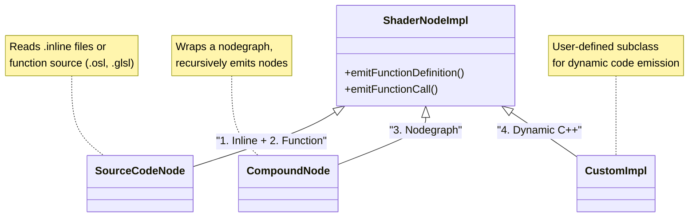

# metashade-mtlx

This project prototypes extending [MaterialX](https://github.com/AcademySoftwareFoundation/MaterialX) shader code generation with [Metashade](https://github.com/metashade/metashade), a Pythonic shader EDSL.

## Node Implementations as a Plugin Mechanism

To understand how Metashade can extend MaterialX codegen, it is crucial to distinguish between MaterialX concepts of Node **Definitions** and Node **Implementations**.

* **NodeDef (`<nodedef>`):** The interface. It defines inputs, outputs, and types (e.g., `ND_burley_diffuse_bsdf`).
* **Implementation (`<implementation>`):** The logic. It points to source code or a nodegraph that implements the computations.

Crucially, **Implementations reference NodeDefs, not the other way around.**

This architecture allows Metashade to generate either new MaterialX node definitions complete with implementations, or new MaterialX node implementations for existing MaterialX nodes, without modifying the core MaterialX definitions.

## MaterialX Node Implementation Code Generation mechanisms

In order to understand how Metashade's codegen can integrate with MaterialX's, let's first discuss how MaterialX generates code for individual nodes.

MaterialX uses [4 different codegen approaches](https://github.com/AcademySoftwareFoundation/MaterialX/blob/main/documents/DeveloperGuide/ShaderGeneration.md#13-node-implementations):

1. **Inline Expression** — The node implementation is specified as a simple inline expression directly in the node definition. This is used for straightforward operations that can be expressed in a single line (e.g., `{{in1}} + {{in2}}` for an add node). The expression uses the target shading language syntax with input ports wrapped in double curly brackets.

2. **Shading Language Function** — The node is implemented as a function written in the target language (GLSL, OSL, etc.), with the source code stored in a separate file. The function signature matches the nodedef's interface of typed inputs and outputs.

3. **Nodegraph Implementation** — The node is implemented as a compound nodegraph composed of other nodes. This is useful for creating reusable compound operations or compatibility graphs for unknown/proprietary nodes.

4. **Dynamic Code Generation (C++)** — A C++ class derived from `ShaderNodeImpl` handles the implementation, emitting code programmatically during shader generation. This is used when static source code isn't sufficient — for example, when code needs to be customized based on node parameters, or when vertex streams and uniforms need to be created dynamically.

### Key Implementation Classes

The following diagram shows how the four code generation methods map to `ShaderNodeImpl` subclasses:

---

## Roadmap

### Phase 1: Static Source Code Nodes (Current State)

Metashade can generate static GLSL or HLSL/Slang source code and the accompanying `.mtlx` implementation files.

Because standard "Source Code Nodes" in MaterialX are typically static assets (loading a `.glsl` file from disk), Metashade can already fully reimplement them.

**The Workflow:**
1.  Write node logic in Python using Metashade.
2.  Run Metashade to generate `node_impl.glsl` and `node_impl.mtlx`.
3.  MaterialX loads these files at runtime exactly as it would load the standard library.

This allows us to immediately start optimizing complex mathematical functions (like PBR Distribution terms) or unrolling heavy procedural loops (like Noise).

### Phase 2: Source Code Node Acquisition (Planned)

The next step is **Hybrid Graph Generation**. We aim to let Metashade "acquire" (call) existing MaterialX source code nodes.

Instead of rewriting every single utility node in Python immediately, Metashade will inspect existing MaterialX `NodeDefs` and expose them as callable Python functions during generation.

**The Concept:**
* Metashade parses `ND_fractal3d_float`.
* It exposes a Python callable: `stdlib.fractal3d(...)`.
* When invoked in a Metashade graph, it emits the correct native function call in the generated GLSL.

This bridges the gap, allowing users to write high-level imperative control flow (Python) that orchestrates low-level atomic operations (Standard MaterialX Library).

### Phase 3: Dynamic Runtime Generation (Experimental)

The ultimate goal is to move beyond static files and enable **Just-In-Time (JIT) Optimization**.

In this model, Metashade integrates directly into the MaterialX `ShaderGen` step via a custom C++ node running an embedded Python interpreter.

**The Workflow:**
1.  A "Dynamic Node" in the graph captures design-time constants from the current material instance.
2.  The C++ `ShaderGen` passes these constants to the embedded Metashade interpreter.
3.  Metashade generates a **bespoke GLSL implementation** on the fly for *that specific material*.

**Why this matters:**
This allows for optimizations that are impossible with static files, such as baking a "Generic Blur" node that unrolls its sampling loop based on a specific kernel size, or stripping dead code branches based on constant inputs (e.g., removing Anisotropy logic if `roughness` is isotropic).

A proof-of-concept implementation of this approach exists in the [`metashade/dev` branch](https://github.com/ppenenko/MaterialX/tree/metashade/dev) of MaterialX. See the [`MetashadeNode`](https://github.com/ppenenko/MaterialX/tree/metashade/dev/source/PyMaterialX/PyMaterialXMetashade) class, which demonstrates embedding Python into MaterialX's `ShaderGen` step via pybind11.

---

## Why Metashade?

Integrating Metashade into MaterialX offers benefits across the pipeline, from authoring to runtime execution.

### For the Runtime (Performance)
* **Dead Code Elimination:** Unlike GLSL drivers which struggle with uniform-based branching, Metashade performs graph-aware analysis. If an input is unconnected or constant, the associated code branch is stripped *before* the GPU ever sees it.
* **Register Pressure Reduction:** By specializing generalized ubershaders (like `standard_surface`) into micro-shaders, we significantly reduce the number of temporary variables (VGPRs), allowing higher occupancy on the GPU.
* **Loop Unrolling:** Procedural patterns (Noise, Voronoi) can be unrolled based on design-time constants (octaves), replacing heavy loops with flat arithmetic sequences.

### For the Pipeline (Safety)
* **Global Sanitization:** Metashade can inject "Safe Math" wrappers (e.g., `safe_pow`, `safe_div`) globally across all generated code, preventing NaN explosions in production renders caused by bad user inputs (e.g., `roughness=0`).
* **Validation:** Python-side type checking catches invalid node connections or parameter types during generation, providing readable error messages instead of cryptic driver crashes.

### For the Developer (Architecture)
* **Imperative Authoring:** Write complex node logic using standard Python control flow (`if`, `for`, `try`) instead of manually constructing XML nodegraphs.
* **Source Code Acquisition:** (Planned) Metashade will be able to wrap existing MaterialX source code nodes, allowing developers to rewrite high-level graph topology in Python while reusing optimized low-level GLSL atoms.
